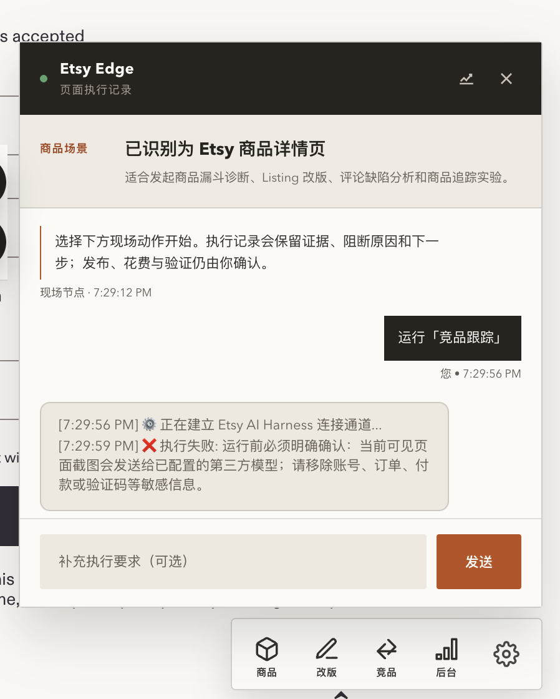
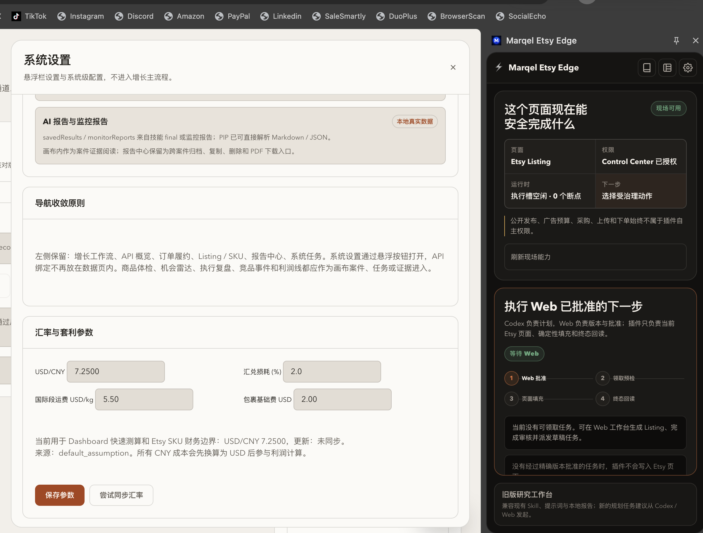

# Marqel Etsy Edge 2.0 product and industrial audit

Audit date: 2026-09-04  
Scope: Etsy page Dock, Side Panel, node Dashboard, manifest permissions, model/config boundary, Web task adapter, evidence and terminal readback.  
Mode: combined UX, accessibility, product-boundary and delivery audit.

## Audit evidence

### Step 1 — Etsy page Dock and expanded overlay

Health before remediation: **fail**.

The surface presented product diagnosis, Listing rewrite, competitor analysis, backend and settings as peer actions. The expanded panel remained a chat-shaped workflow with an optional instruction input. This implied that the extension owned reasoning and research even though the new product contract assigned those responsibilities to Codex/Web. The large panel also obscured Etsy content and forced the user to choose a capability before seeing an approved task.

Accessibility risks visible in the screenshot included weak secondary-text contrast, competing navigation targets, dense long-form status text and a large overlay over the underlying page. Keyboard order and screen-reader behavior could not be confirmed from the screenshot.

Remediation: the v2 content script contains no chat or analysis panel. The Dock has only `任务 / Web / 设置`, opens the native Side Panel, and displays a small runtime state. There is no free-form competitor action.

### Step 2 — Dashboard settings drawer and Side Panel

Health before remediation: **fail**.

The left settings drawer and right Side Panel duplicated extension state while mixing business parameters, report storage, API connection, model configuration and runtime controls. The Side Panel still exposed a compatibility research workbench. Users could not reliably answer which settings were authoritative or whether a change belonged to the browser node or the business system.

Accessibility risks visible in the screenshot included two simultaneous modal/panel contexts, excessive information density, small muted copy, and unclear reading/focus ownership. Focus trapping and escape behavior could not be confirmed from the screenshot.

Remediation: the Dashboard was replaced by a read-only Node Console. The only settings page is `sidepanel.html#settings`, containing device authorization, runtime identity, site scope and hard boundaries. Model, FX, margin, research and business settings do not exist in the v2 extension.

## Product-boundary verdict

Before remediation: **did not meet the new positioning**. The product still shipped a local agent, Skills, research actions, monitoring, reports, business settings and broad host permissions.

After source remediation: **meets the intended architectural boundary at source/package level**.

| Capability | Codex | Web | Edge 2.0 |
| --- | --- | --- | --- |
| Competitor/trend research | Owns | Stores brief/evidence/decision | No analysis or competitor evidence collection |
| Listing recommendation | Owns | Versions and approves | No generation |
| Business parameters | Uses | Owns | No local copy |
| Task authorization | Consumes | Owns | Revalidates at execution |
| Etsy page mutation | Does not assume success | Dispatches exact task | Allowlisted fields only |
| Evidence/readback | Interprets | Persists and reconciles | Captures and submits |
| Public publish/spend | No autonomous authority | Separate approval/human flow | Forbidden |

## Runtime and permission audit

Manifest 2.0 removes `activeTab`, `tabs`, `scripting` and every non-Etsy/non-Marqel host. Etsy host access is sufficient for matching-tab metadata, the declared content scripts and visible-page capture; generic tab access is unnecessary. Chrome floor is 116 because user-gesture `sidePanel.open()` begins there. Removed host classes include OpenAI, Anthropic, DashScope, OpenRouter, Groq, Google, Google Trends, Bing, Amazon, eBay, Pinterest, GitHub release manifests and exchange-rate providers.

The package no longer includes `skills/`, the old `background.js`, old `content.js`, agent loop, tool registry, local report UI, workflow canvas, print/export surfaces, shared compatibility CSS or model UI. It includes only the device/task/runtime modules needed by Edge.

On install/update, v2 removes retired local model/image credentials, reports, monitor tasks/events, growth cases/runs, workflow checkpoints/scheduler state and finance settings. There is deliberately no backward-compatibility migration UI.

## Active business chain

The implemented vertical path is:

1. Web creates an `etsy_publish` task for `upload_draft`.
2. Task carries `etsy-listing-draft.v1`, `approvalId`, `expectedUpdatedAt`, `etsyAutomationPermissionRef`, and `publicPublishAllowed=false`.
3. Edge claims or resumes a valid lease.
4. Edge re-reads the operation and exact draft version.
5. On an allowlisted Etsy editor route, Edge fills only supported fields and verifies their values; partial failure rolls back all touched fields.
   The runtime never falls back to another background Etsy tab: the current active tab must itself be the matching Etsy surface.
6. Edge never clicks Save or Publish. Tags, images and unsupported dynamic fields remain manual.
7. The operator may save a task-bound privacy-masked screenshot to the Web artifact store.
8. After a visible human save-as-draft, the operator records Etsy draft ID/URL or a failure reason.
9. Edge uploads a redacted readback artifact and reconciles task, operation and Listing draft terminal state.
10. If response delivery is uncertain, repeat execution is disabled and only read-only reconciliation is allowed.

The audit initially found a real cross-system contract defect: Edge submitted privacy-masked evidence as `image/jpeg`, while the Web Artifact endpoint accepted only structured JSON. The Web endpoint now accepts JPEG only for a claimed `etsy_publish` / `etsy_adspower` task, validates the JPEG byte signature, source platform, task lease, claimant, size, SHA-256 and redaction status, encrypts it at rest as `etsy_task_viewport`, and keeps terminal readback restricted to the separate `etsy_publish_readback` JSON kind. This prevents screenshot evidence from being used as a forged success readback.

## Verification performed

- Node `22.23.2` `npm run test:release`: lint plus 8 active v2 smoke suites passed.
- Control Center `npm test`: the full Web suite passed, including the JPEG task-evidence vertical path and rejection of malformed JPEG evidence.
- Syntax checks passed for the service worker, content script, Side Panel, Dashboard, auth and capability modules.
- `npm audit --omit=dev --audit-level=high`: zero known production-dependency vulnerabilities.
- Package-content assertions confirm that the release script does not ship old Skills, agent/runtime files or compatibility surfaces.
- Static contract tests verify sensitive-route blocking, privacy-mask restoration, exact draft preflight, atomic DOM rollback, no Save/Publish clicks, human confirmation, uncertain-readback reconciliation and one-settings-surface routing.
- Local visual rendering checked the Side Panel at a 420 px viewport, the single settings route and the read-only Node Console. This is layout evidence only, not target-profile acceptance.
- Development package: 26 files, SHA-256 `62647e63395c073cbf03a6011f2ca6d109ac6b0e359795cf37ba48bc14308745`; its manifest correctly records `source_dirty=true`.
- `npm run release:readiness` correctly returned `ok=false` because the checkout is dirty and RB-01 through RB-07 remain unexecuted.

## Remaining delivery blockers

Industrial production readiness remains **blocked**:

- The worktree is dirty and not tied to a reviewed commit.
- No exact Etsy written authorization artifact was found in this repository.
- No target AdsPower Profile, Chrome version, runtime Extension ID or Control Center installation readback has been captured for v2.
- The new Dock, Side Panel and Node Console have not been accepted in the actual target browser profile.
- The Etsy editor selectors have not been exercised against current real Etsy locale/A-B variants.
- No real Web-approved task has completed field fill, human save, evidence upload and terminal reconciliation under v2.
- The active-tab rule prevents silent writes to a background Etsy tab, but the current task contract still lacks a separately verified target-shop/profile binding that can prove the visible editor belongs to the intended Etsy shop. The AdsPower Profile remains a real-browser acceptance dependency.
- No design-partner measurement yet proves fewer copy steps, lower error rate or improved outcome-cycle time.

Therefore the valid status is **source candidate, not production-ready and not proven to execute the complete Etsy business**.

## Decision

Keep Edge only as a governed last-mile adapter. Do not restore competitor analysis or any local intelligence surface. If the official Etsy API or Codex Browser can perform an Edge action with equal safety, identity isolation and terminal evidence, remove that Edge action. The extension earns its existence through stricter execution control and verifiable readback, not by duplicating intelligence.
